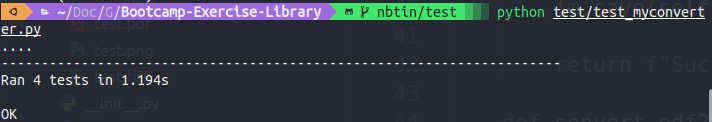

# Bootcamp-Exercise-Library

### Create Anaconda environment

```
conda env create -f environment.yml
conda activate cinna-lab2
```

### Define pakage

```
python -m pip install -e . 
```

### Run unit tests
Run the following command:

```
python test/test_myconverter.py
```

### Unit test result
